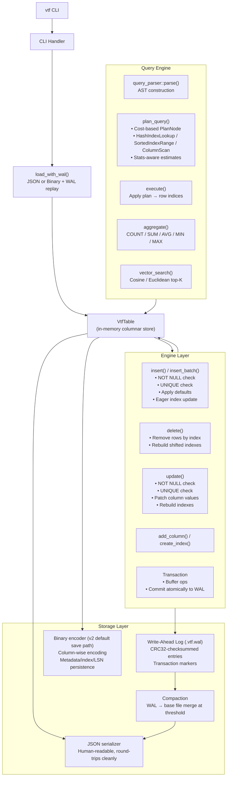
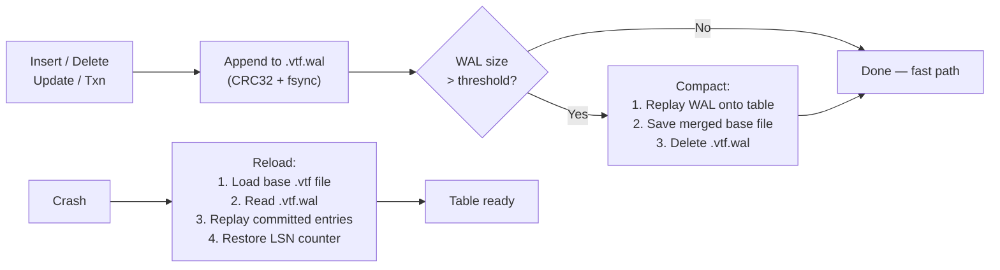
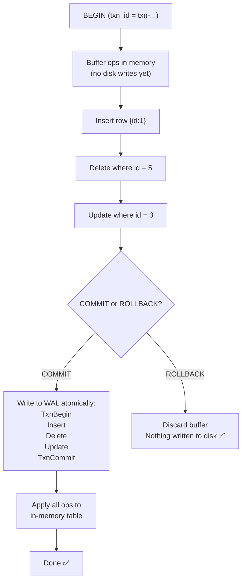
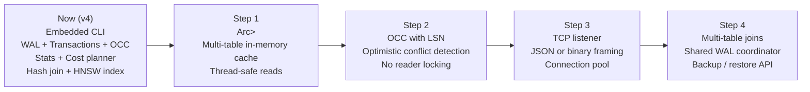

# VTF — Vector Table Format

A columnar, typed, embedded database built in Rust.  
VTF stores data column-by-column (not row-by-row), uses a Write-Ahead Log for crash safety, supports multi-operation transactions with OCC (LSN-based conflict detection), cost-based query planning, hash/sorted indexing, hash joins, and vector similarity search with HNSW acceleration — all from a single binary with zero runtime dependencies.

---

## Why VTF?

Most databases store rows as packed blobs. When you query `SELECT avg(salary) FROM employees`, a row-oriented database touches every byte of every row — even columns you don't care about.

VTF stores each column as a contiguous typed array:

```
┌────────────────────────────────────────────────┐
│  id    │  1  │  2  │  3  │  4  │  5  │        │
│  name  │ "A" │ "B" │ "C" │ "D" │ "E" │  …     │
│  score │  92 │  77 │  85 │  91 │  68 │        │
└────────────────────────────────────────────────┘
```

This means:
- Column aggregations (`sum`, `avg`, `min`, `max`) touch only the target column
- Projection pushdown skips loading columns not in `SELECT`
- Null bitmaps are cheap — one bit per cell
- Binary compression is effective because similar values are adjacent

### VTF vs. SQLite vs. MongoDB

| Feature                  | VTF          | SQLite         | MongoDB        |
|--------------------------|:------------:|:--------------:|:--------------:|
| Storage model            | Columnar     | Row (B-tree)   | Row (BSON)     |
| Column aggregations      | Fast         | Full scan      | Full scan      |
| Transactions             | ✅ WAL-based | ✅ WAL-based   | ✅ (multi-doc) |
| Schema constraints       | UNIQUE, NOT NULL, DEFAULT | Full SQL | Optional |
| Vector search            | ✅ Built-in  | ❌             | ❌ (separate)  |
| File format              | Binary v2 (default) + JSON export | SQLite binary | BSON |
| Human-readable at rest   | Optional (JSON export) | ❌             | ❌             |
| Crash recovery           | WAL replay   | WAL replay     | Oplog replay   |
| Embeds in Rust binary    | ✅           | via C FFI      | ❌             |
| Server-ready foundation  | ✅ LSN + OCC | ✅             | ✅             |

---

## What's new in V3.1 + V4

This release wave focuses on correctness and engine maturity: typed index correctness, typed scan hot paths, statistics + `ANALYZE`, cost-based planning with richer `EXPLAIN` output, index consistency checks, hash joins, OCC via LSN, binary format v2 as default storage, and HNSW vector indexes.

| Milestone | What shipped |
|-----------|----------------|
| **v2** | Columnar engine, binary + zstd, WAL file format, compaction, file locking |
| **v3** | WAL on write path, `vtf aggregate`, `vtf txn`, crash-safe partial-transaction discard |
| **v3.1** | Typed sorted-index fix, typed scan hot path, stats + `vtf analyze`, cost-based planner, enriched `vtf explain`, `vtf check` |
| **v4 (current)** | Hash join (`vtf join`), OCC via LSN, binary v2 default save path, HNSW index (`vtf build-vector-index`) |

### WAL on the hot path

- Every insert, delete, update, and committed transaction appends one logical entry to **`.vtf.wal`** (JSON line + tab-separated **CRC32**), then applies the change in memory. The base `.vtf` file is refreshed through **compaction**, not on every op.
- **`load_with_wal`** loads the base table, replays the WAL, and logs `[WAL] Replayed N entries in …ms` to stderr when the WAL is non-empty.
- **Auto-compaction** runs when the WAL holds **100** or more entries (see `DEFAULT_COMPACTION_THRESHOLD` in `src/storage/wal.rs`): replay into a new base file, then delete the WAL.

### `vtf aggregate`

- Runs **`count`**, **`sum`**, **`avg`**, **`min`**, **`max`** directly on a column’s vector (`--column` / `--function`).
- **`--function`** accepts a comma-separated list to print several aggregates in one invocation.
- Optional **`--where`** uses the same filter and expression syntax as **`vtf query`**.

### `vtf txn` and `Transaction`

- **`vtf txn <file> --ops '[...]'`** takes a JSON array of **`insert`** (with **`row`**), **`delete`** (with **`where`**), and **`update`** (with **`where`** + **`set`**). Each operation is validated against the current table before anything is written.
- On commit, the engine writes **`txn_begin`** { `txn_id` }, each operation, then **`txn_commit`** { `txn_id` } to the WAL and applies the batch to the table.
- In Rust, **`Transaction::insert`**, **`insert_batch`**, **`delete`**, and **`update`** buffer ops; **`commit(path, &mut table)`** flushes to WAL and applies, **`rollback()`** drops the buffer with no disk write.
- If the process dies after **`txn_begin`** but before **`txn_commit`**, replay **skips the whole uncommitted group** so the table never sees a half-finished transaction.

### `vtf explain`

- Loads the table (including WAL replay) and prints the **query plan** for a **`--where`** expression: hash index lookup, sorted index range, column scan, and how **`AND` / `OR` / `NOT`** combine.
- Output now includes per-node **estimated rows** and **cost** from the cost-based planner.

### Schema constraints on `vtf create`

- **`--unique "col,col"`** — non-null duplicate values rejected (nulls still allowed in nullable columns).
- **`--not-null "col,col"`** — insert/update may not set those columns to JSON `null`.
- **`--default '{"col": value}'`** — missing keys on insert are filled before NOT NULL / UNIQUE checks.

### LSN + OCC

- **`lsn`** increments on each committed write and is persisted in storage.
- `Transaction::new(&table)` captures `read_lsn`; `commit()` checks for changes and returns `VtfError::OccConflict` when `table.lsn != read_lsn`.

---

## Architecture

### Full Engine Pipeline



### WAL Lifecycle



---

## File Format

VTF tables are stored on disk as binary (v2) by default, with an optional WAL (`.vtf.wal`).  
`io::load` auto-detects JSON, binary v1, and binary v2.

JSON representation (for readability/export):

```json
{
  "version": "1.0",
  "columns": [
    { "name": "id",    "type": "int"    },
    { "name": "email", "type": "string" },
    { "name": "score", "type": "float"  }
  ],
  "rowCount": 3,
  "data": {
    "id":    [1, 2, 3],
    "email": ["a@x.com", "b@x.com", "c@x.com"],
    "score": [98.5, 74.2, 86.0]
  },
  "meta": {
    "primaryKey": "id",
    "uniqueColumns": ["email"],
    "notNullColumns": ["email"],
    "defaults": { "score": 0.0 }
  },
  "indexes": {
    "id": {
      "type": "hash",
      "columnType": "int",
      "map": { "1": [0], "2": [1], "3": [2] }
    }
  },
  "lsn": 3,
  "extensions": {}
}
```

### Supported Column Types

| Type             | JSON form                     |
|------------------|-------------------------------|
| `int`            | `42`                          |
| `float`          | `3.14`                        |
| `string`         | `"hello"`                     |
| `boolean`        | `true`                        |
| `date`           | `"2024-01-15T00:00:00Z"`      |
| `array<int>`     | `[1, 2, 3]`                   |
| `array<float>`   | `[0.1, 0.9]`  (vector search) |
| `array<string>`  | `["tag1", "tag2"]`            |

---

## Schema Constraints

VTF v3 adds three optional schema constraints, stored in `meta` and enforced on every insert and update.

### NOT NULL

Rejects null values for the specified columns on insert and update.

```bash
vtf create users.vtf --columns "id:int,email:string,name:string" \
    --primary-key id \
    --not-null "email,name"
```

```bash
# This will fail: name is NOT NULL
vtf insert users.vtf --row '{"id":1,"email":"a@x.com","name":null}'
# Error: not null constraint: column 'name' does not allow null values
```

### UNIQUE

Ensures no two rows have the same value in the specified column (nulls are always permitted).

```bash
vtf create users.vtf --columns "id:int,email:string" \
    --primary-key id \
    --unique "email"
```

```bash
# Second insert will fail if email already exists
vtf insert users.vtf --row '{"id":2,"email":"a@x.com"}'
# Error: unique constraint violation: duplicate value 'a@x.com' in column 'email'
```

### DEFAULT

Fills in a column value when it is omitted from an insert. The default is applied before all other validation.

```bash
vtf create events.vtf --columns "id:int,status:string,score:float" \
    --primary-key id \
    --default '{"status":"pending","score":0.0}'
```

```bash
# status and score will be filled from defaults
vtf insert events.vtf --row '{"id":1}'
```

---

## Transactions

VTF supports multi-operation transactions with atomicity and crash safety (see [What's new in V3.1 + V4](#whats-new-in-v31--v4)).

### How it works



### Crash recovery

If the process crashes after `TxnBegin` but before `TxnCommit`, WAL replay finds no matching `TxnCommit` and **silently skips the entire group**. The table is restored to the state before the transaction.

### CLI usage

```bash
vtf txn users.vtf --ops '[
  {"op": "insert", "row": {"id": 10, "name": "Alice", "email": "alice@x.com"}},
  {"op": "delete", "where": "id = 5"},
  {"op": "update", "where": "id = 3", "set": {"name": "Robert"}}
]'
# Transaction committed (3 operations, rowCount: 42)
```

### Rust API

```rust
use vtf::engine::transaction::Transaction;

let mut txn = Transaction::new(&table); // captures read_lsn for OCC
txn.insert(row1);
txn.delete("id = 5", vec![json!(5)]);
txn.update("id = 3", vec![json!(3)], updates);

txn.commit(&vtf_path, &mut table)?;
// or txn.rollback(); // discards everything
```

---

## Query Engine

### Filter syntax

```bash
# Equality
vtf query users.vtf --where "status = active"

# Comparison  
vtf query users.vtf --where "age > 25"
vtf query users.vtf --where "score <= 90"

# Boolean combinator
vtf query users.vtf --where "age > 25 AND active = true"
vtf query users.vtf --where "role = admin OR role = moderator"

# Negation
vtf query users.vtf --where "NOT status = deleted"
```

### EXPLAIN — query plan inspection

The `explain` command loads the table (and replays the WAL), parses **`--where`**, and prints the planner tree. It does **not** evaluate the filter over rows for output—it only shows the execution strategy:

```bash
vtf explain users.vtf --where "age > 25 AND active = true"
```

```
Query plan for: age > 25 AND active = true

└── Intersect  [est. rows: 120, cost: 132.4]
    ├── SortedIndexRange(age > 25)  [sorted index]  [est. rows: 180, cost: 95.4]
    └── ColumnScan(active = true)   [full scan]     [est. rows: 260, cost: 500.0]

500 rows in table, 1 index(es) available
```

### Aggregations

```bash
vtf aggregate users.vtf --column id --function count
vtf aggregate users.vtf --column score --function sum
vtf aggregate users.vtf --column score --function avg --where "active = true"
vtf aggregate users.vtf --column age --function min
vtf aggregate users.vtf --column salary --function max
```

### Vector search

```bash
vtf search embeddings.vtf --column vector \
    --vector "[0.1, 0.9, 0.3]" \
    --top-k 5 \
    --metric cosine
```

Supported metrics: `cosine`, `euclidean`  
If an HNSW index exists for the column and metric is cosine, search routes through HNSW; otherwise it falls back to brute-force.

---

## Query Planning (Cost-Based)

The planner now uses a lightweight cost model:

- `scan_cost = row_count`
- `hash_cost ≈ hit_count + lookup overhead`
- `sorted_range_cost ≈ estimated_rows + log2(distinct_count)`

When valid column stats are available (`vtf analyze`), estimates use `distinct_count`, `min`, and `max`.  
When stats are stale or missing, the planner falls back to heuristics.

---

## Write-Ahead Log (WAL)

Every mutation is first appended to `.vtf.wal` with a CRC32 checksum; the base `.vtf` file is updated when **compaction** merges the WAL (by default after **100** WAL entries—see v3 notes above). On reload, VTF replays committed WAL entries on top of the base file.

### WAL entry format

```
{"op":"insert","row":{"id":1,"name":"Alice"}}\t3f7a1b2c
{"op":"delete","filter":"id = 5","pk_values":[5]}\ta1b2c3d4
{"op":"txn_begin","txn_id":"txn-1714000000-0001"}\t...
{"op":"insert","row":{"id":99,"name":"Bob"}}\t...
{"op":"txn_commit","txn_id":"txn-1714000000-0001"}\t...
```

### Predicate-based Delete/Update

Older databases store physical row indices in their WAL (`delete indices [3, 7]`). This breaks when earlier deletes shift row positions. VTF stores **logical predicates + primary key values** instead:

```json
{"op":"delete","filter":"status = deleted","pk_values":[3,7,12]}
```

On replay, VTF looks up the current row index for each PK — so the WAL is always safe to replay regardless of row shifts from earlier entries.

---

## Log Sequence Number (LSN)

Every committed write increments `table.lsn`. The LSN is persisted in storage (binary v2 or JSON) and restored on reload.

```bash
vtf info users.vtf
# VTF v1.0
# Rows: 500
# LSN: 47
```

LSN now powers **Optimistic Concurrency Control** in transactions:

```rust
let mut txn = Transaction::new(&table);
// ... add ops
if let Err(VtfError::OccConflict { .. }) = txn.commit(&path, &mut table) {
    // reload and retry
}
```

---

## Server Roadmap

VTF is designed to become a server-side database. The current embedded engine is the foundation:



Each step builds on the previous:
- **LSN** (done) enables OCC without complex lock management
- **Predicate WAL** (done) makes replay safe across concurrent writes
- **Transactions** (done) provide multi-op atomicity, which a server just exposes over the wire
- **RwLock table store** wraps the existing `VtfTable` with no engine changes

---

## Quick Start

### 2-minute walkthrough (recommended)

```bash
# 1) Create + insert
vtf create users.vtf --columns "id:int,name:string,age:int,active:boolean,embedding:array<float>" --primary-key id
vtf insert users.vtf --rows '[{"id":1,"name":"Alice","age":30,"active":true,"embedding":[0.1,0.2,0.3]},{"id":2,"name":"Bob","age":25,"active":false,"embedding":[0.3,0.1,0.2]}]'

# 2) Build planner stats + inspect plan
vtf analyze users.vtf
vtf explain users.vtf --where "age > 20 AND active = true"

# 3) Build vector index + search
vtf build-vector-index users.vtf --column embedding
vtf search users.vtf --column embedding --vector "[0.1,0.2,0.25]" --top-k 2 --metric cosine

# 4) Check index consistency
vtf check users.vtf
```

### Build

```bash
cargo build --release
```

### Create a table

```bash
vtf create users.vtf --columns "id:int,name:string,age:int,active:boolean" --primary-key id
```

### Insert rows

```bash
vtf insert users.vtf --row '{"id": 1, "name": "Alice", "age": 30, "active": true}'

vtf insert users.vtf --rows '[
  {"id": 2, "name": "Bob", "age": 25, "active": false},
  {"id": 3, "name": "Charlie", "age": 35, "active": true}
]'
```

### Query

```bash
vtf query users.vtf
vtf query users.vtf --where "age > 25"
vtf query users.vtf --where "age >= 25 AND active = true" --select "name,age" --limit 10
```

### Vector similarity search

```bash
vtf create docs.vtf --columns "id:int,text:string,embedding:array<float>" --primary-key id
vtf insert docs.vtf --row '{"id": 1, "text": "hello", "embedding": [0.12, -0.98, 0.44]}'
vtf search docs.vtf --column embedding --vector "[0.1, -0.9, 0.5]" --top-k 5 --metric cosine
```

### Aggregations

```bash
vtf aggregate users.vtf --column age --function avg
vtf aggregate users.vtf --column age --function "count,sum,avg,min,max" --where "active = true"
```

### Analyze statistics

```bash
vtf analyze users.vtf
```

### Check index consistency

```bash
vtf check users.vtf
```

### Indexes

```bash
vtf create-index users.vtf --column name --type hash
vtf create-index users.vtf --column age --type sorted
vtf drop-index users.vtf --column name
```

### Join

```bash
vtf join users.vtf orders.vtf --on id=user_id --output joined.vtf
```

### Build vector index

```bash
vtf build-vector-index docs.vtf --column embedding
```

### Export

```bash
vtf export users.vtf
vtf export users.vtf --pretty
vtf export users.vtf --format binary --output users.vtfb
vtf export users.vtf --format compressed --output users.vtfz
```

### Add a column

```bash
vtf add-column users.vtf --name email --type string
```

---

## CLI Reference

### Create a table

```bash
vtf create <file.vtf> \
    --columns "col:type,col:type,..." \
    [--primary-key <col>] \
    [--unique "col1,col2"] \
    [--not-null "col1,col2"] \
    [--default '{"col": value}']
```

### Insert rows

```bash
vtf insert <file.vtf> --row '{"col": value, ...}'
vtf insert <file.vtf> --rows '[{...}, {...}]'
```

### Query rows

```bash
vtf query <file.vtf> \
    [--where "expr"] \
    [--select "col1,col2"] \
    [--limit N]
```

### Delete rows

```bash
vtf delete <file.vtf> --where "col = value"
```

### Update rows

```bash
vtf update <file.vtf> --where "col = value" --set '{"col": new_value}'
```

### Transactions

```bash
vtf txn <file.vtf> --ops '[
  {"op":"insert","row":{...}},
  {"op":"delete","where":"id = 5"},
  {"op":"update","where":"id = 3","set":{"name":"Bob"}}
]'
```

### Explain a query plan

```bash
vtf explain <file.vtf> --where "age > 25 AND active = true"
```

### Analyze and consistency checks

```bash
vtf analyze <file.vtf>
vtf check <file.vtf>
```

### Aggregations

```bash
vtf aggregate <file.vtf> --column <col> --function <fn>[,<fn>...] [--where expr]
# fn: count, sum, avg, min, max
```

### Vector search

```bash
vtf search <file.vtf> --column col --vector "[...]" --top-k N --metric cosine|euclidean
vtf build-vector-index <file.vtf> --column <array_float_column>
```

### Index management

```bash
vtf create-index <file.vtf> --column col --type hash|sorted
vtf drop-index <file.vtf> --column col
```

### Join

```bash
vtf join <left.vtf> <right.vtf> --on left_col=right_col [--output <joined.vtf>]
```

### Schema

```bash
vtf add-column <file.vtf> --name col --type <type>
vtf validate <file.vtf>
vtf info <file.vtf>
```

### Export

```bash
vtf export <file.vtf> [--pretty] [--format json|binary|compressed] [--output <path>]
```

---

## Building

```bash
git clone https://github.com/your-org/VTF-db
cd VTF-db
cargo build --release
cargo test
```

The binary is at `target/release/vtf`.

---

## License

MIT
